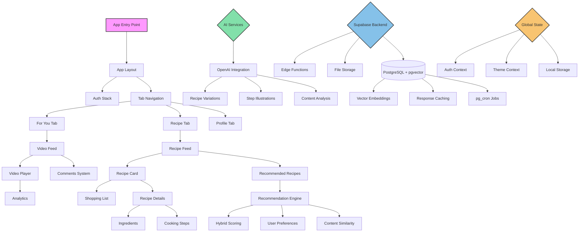

# TikTok Clone

A modern TikTok clone built with Expo, React Native, and TypeScript.

## Features

### Video Feed
- ✅ Vertical scrolling video feed with snap functionality
- ✅ Auto-play videos when in view
- ✅ Custom play/pause controls
- ✅ Video descriptions and user information overlay
- ✅ Performance optimizations (video preloading, recycling)
- ✅ Header with contextual back button
- ✅ Search overlay with modern UI

### Recipe Features
- ✓ Dedicated recipe feed with tab navigation
- ✓ Recipe metadata display (cooking time, servings, calories)
- ✓ Recipe details modal with ingredients and steps
- ✓ Recipe search and filtering
- ✓ Recipe saving/bookmarking
- ✓ Difficulty level badges
- ✓ Cuisine type indicators
- ✓ Dietary preference tags
- ✓ Step-by-step illustrations with AI generation
- ✓ Smart image preloading and caching
- ✓ Progressive loading and error recovery
- ✓ Context-aware step visualization
- ✓ Equipment-aware demonstrations

### Dynamic Recipe Variations
- ✅ AI-powered recipe variations
- ✅ Interactive recipe chat assistant
- ✅ Variation history tracking
- ✅ Smart ingredient substitutions
- ✅ Variation type detection (dietary, portions, methods)
- ✅ Real-time recipe modifications
- [ ] Nutrition analysis and optimization
- [ ] Cooking technique guidance
- [ ] Context-aware recipe assistance
- [ ] Voice command support
- [ ] Multi-language recipe support

### AI Agent Service
- ✓ OpenAI integration with caching
- ✓ Modular prompt builder system
- ✓ Specialized recipe variation prompts
- ✓ Error handling with retry logic
- ✓ Response caching and optimization
- ✓ Step-specific image generation
- ✓ Context-aware visual prompts
- ✓ Multi-style illustration support
- ✓ Equipment-aware demonstrations
- [ ] Telemetry and metrics collection
- [ ] Circuit breaker implementation
- [ ] Request throttling
- [ ] Comprehensive testing suite

### Shopping List
- ✅ Add ingredients from recipes
- ✅ Check/uncheck items
- ✅ Share list functionality
- ✅ Smart quantity and unit parsing
- ✅ Delete individual items
- ✅ Clear checked items
- ✅ Toast notifications
- ✅ Variation support with substitutions
- ✅ Smart ingredient combining
- ✅ Variation-aware quantity scaling
- [ ] Quantity adjustment controls
- [ ] Enhanced substitution display
- [ ] Improved variation grouping UI
- [ ] Better ingredient organization

### Social Features
- ✅ Comments system with real-time updates
- ✅ Creator profiles with video grid
- ✅ Like/save functionality
- ✅ Share videos and recipes
- ✅ Follow creators

### Recommendation System
- ✅ Personalized video recommendations
- ✅ Hybrid scoring (engagement + content similarity)
- ✅ Automatic score updates
- ✅ OpenAI-powered content analysis
- ✅ Video metrics tracking
- ✅ User engagement analytics
- ✅ Transparent recommendation explanations
- ✅ User feedback and preference learning
- ✅ Real-time score adjustments
- ✅ Seasonal and time-based boosts
- ✅ Embedding-based content matching
- ✅ Automated batch processing
- [ ] Variation preference learning
- [ ] AI interaction based recommendations

### Infrastructure
- ✅ Modular AI prompt builder system
- ✅ Response caching with Supabase
- ✅ Edge Function integration
- ✅ Exponential backoff error handling
- ✅ Automated embedding generation
- ✅ Hourly score recalculation via pg_cron
- ✅ Performance-optimized database queries
- ✅ Comprehensive logging and monitoring
- [ ] Circuit breaker implementation
- [ ] Request throttling
- [ ] Comprehensive testing suite

Detailed documentation for each feature can be found in the [docs/features](docs/features) directory.

## Architecture



## Getting Started

1. Install dependencies
   ```bash
   npm install
   ```

2. Start the development server
   ```bash
   npx expo start
   ```

## Tech Stack
- Expo
- React Native
- TypeScript
- Supabase
- OpenAI
- PostgreSQL + pgvector
- React Query
- React Native Reanimated


## License
MIT
